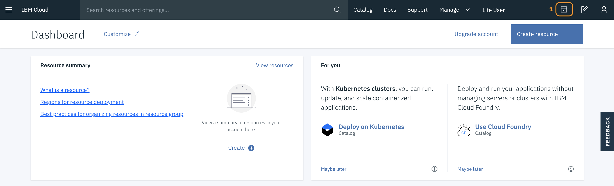
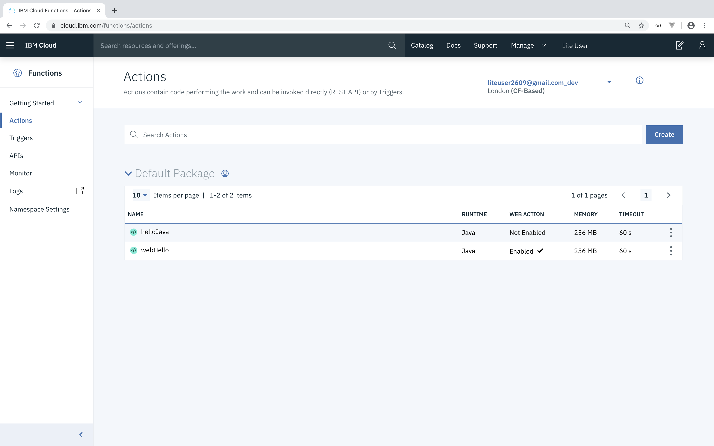
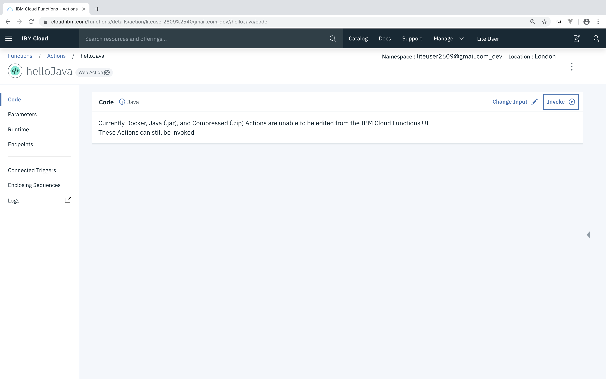
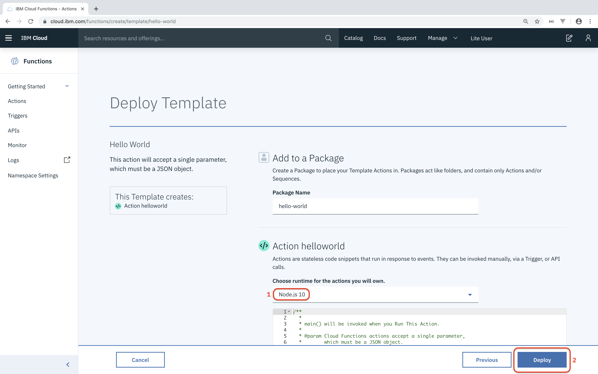

# Java Serverless QuickLab

Serverless functions enables you to decompose business operations into very fine grain chunks of code. Functions provide advantages to an organization by increasing agility and cost savings by allowing "scale to zero" when a function is no longer actively being used.

In this quicklab we will look at how to write Serverless Functions in Java and run them on [Apache Openwhisk](https://openwhisk.apache.org/) hosted on IBM Cloud.

## 0. Setup
1. Go to this link and create an IBM Cloud Account: https://ibm.biz/BdqyTU.

2. If you already have an account, go to the same [link](https://ibm.biz/BdqyTU) and click **Log in** on the top right of the page to continue.

3. Once logged in, open an IBM Cloud Shell by clicking (1)

	

	and wait until the session is ready to use.

4. The default region for the shell is `us-south`. Europe based Lite Account users have `eu-gb` as their region. If necessary, switch region by typing:

	```
	ibmcloud target -r <your_region>
	```

	where `<your_region>` is the value of the region your need to switch to. Contact the workshop organiser if you're not sure what your region is.  

5. Next, complete the IBM Cloud CLI configuration by typing:

	```
	ibmcloud target --cf
	```

6. Make sure you select the IBM Cloud Shell tab in your browser. On the command line clone the repo by typing:

	```
	git clone https://github.com/IBMDeveloperBNL/java-serverless-quicklab
	```

7. Change directory to the cloned repo:

	```
	cd java-serverless-quicklab
	``` 	

## 1. Executing a Serverless Function with the IBM Cloud CLI
1. Run the following command to invoke a test function from the command-line:

   ```
   ibmcloud fn action invoke whisk.system/utils/echo -p message hello --result
   ```

   You should get back a result that looks like this:

   ```json
   {
       "message": "hello"
   }
   ```

	This command verifies that IBM Cloud CLI is configured correctly . If this does not work, please contact the workshop organiser to provide assistance!

## 2. Build and Deploy your First Java Serverless Function

Let's build and deploy our own Java serverless function.

1. Build and jar the Java application:

	```
	./mvnw package
	```

2. Deploy the function to IBM Cloud:

	```
	ibmcloud fn action create helloJava target/hello-world-java.jar --main com.example.FunctionApp
	```

3. Execute the function:

	```
	ibmcloud fn action invoke --result helloJava --param name World
	```

	You should see:

	```json
	{
	    "greetings": "Hello World"
	}
	```

	`--result` means just show the results. Omit that, and see what you get back :)
This also adds the `--blocking` flag, discussed below.

## 3. Getting Familiar with OpenWhisk Commands

Let's take a deeper look at some of the common commands you will be using when running functions on OpenWhisk.

### Executing Functions Asynchronously

So far we have been executing functions synchronously with the `--result` tag. Let's take a look at executing functions asynchronously.

1. To execute a function in asynchronous mode simply omit `--result` when invoking the function:  

	```
	ibmcloud fn action invoke helloJava --param name World
	```

   You should get a response that includes an id you can use to look up the result of the function later:

    ```
    ok: invoked /_/helloJava with id c51e11cf3bad42a39e11cf3badb2a3a3
    ```

2. Use the below command to retrieve the result of the function invocation:

    ```
    ibmcloud fn activation result [id]
    ```
   
    You should get a response that looks something like this:

    ```json
	{
	    "greetings": "Hello World"
	}
	```

	**Note:** Functions execute in asynchronous mode by default, you can also use the tag `--blocking` explicitly invoke a function in asynchronous mode.

### Viewing Function Invocation Information

When invoking a function OpenWhisk is generating diagnostic information that can be used for tracking system usage, debugging, and other purposes.

1. You can view the invocation information of the function we executed earlier with this command:

	```
	ibmcloud fn activation get [id]
	```

	You should get a response back that looks something like this:

	```json
	{
	    "namespace": "[youremail]@mail.com_dev",
	    "name": "helloJava",
	    "version": "0.0.1",
	    "subject": "[youremail]@mail.com",
	    "activationId": "c51e11cf3bad42a39e11cf3badb2a3a3",
	    "start": 1568061913141,
	    "end": 1568061913482,
	    "duration": 341,
	    "response": {
	        "status": "success",
	        "statusCode": 0,
	        "success": true,
	        "result": {
	            "greetings": "Hello! Welcome to OpenWhisk"
	        }
	    },
	    "logs": [
	        "2019-09-09T20:45:13.478869Z    stderr: Sep 09, 2019 8:45:13 PM com.example.FunctionApp main",
	        "2019-09-09T20:45:13.478917Z    stderr: INFO: invoked with params:"
	    ],
	    "annotations": [
	        {
	            "key": "path",
	            "value": "[youremail]@mail.com_dev/helloJava"
	        },
	        {
	            "key": "waitTime",
	            "value": 514
	        },
	        {
	            "key": "kind",
	            "value": "java:8"
	        },
	        {
	            "key": "timeout",
	            "value": false
	        },
	        {
	            "key": "limits",
	            "value": {
	                "concurrency": 1,
	                "logs": 10,
	                "memory": 256,
	                "timeout": 60000
	            }
	        },
	        {
	            "key": "initTime",
	            "value": 308
	        }
	    ],
	    "publish": false
	}
	```

### Viewing Function Invocation Logs

`ibmcloud fn activation get` returns the logs from an invocation, but you can also just view the logs from invocation to make debugging a bit easier.

1. To view the logs from an invocation run the following:

	```
	ibmcloud fn activation logs [id]
	```
	You should get a return thaty looks like this:

	```
	2019-09-09T21:16:27.917303Z    stderr: Sep 09, 2019 9:16:27 PM com.example.FunctionApp main
	2019-09-09T21:16:27.917347Z    stderr: INFO: invoked with params:
	```

2. For longer running functions, you can tail the logs a function is producing with the following command:

	```
	ibmcloud fn activation poll [id]
	```

### Retrieve Most Recent Function Execution

For shorthand purposes you can use the tag `--last` in-lieu of an id to retrieve information about an activation.

```
ibmcloud fn activation [get|result|logs] --last
```

### Show Recent Function Invocations

You can view recent function invocations; id, function executed with the following:

```
ibmcloud fn activation list
```

### Show Available Functions

You can view a list of all functions available in the current namespace with the following:

```
ibmcloud fn list
```

## 4. Creating a Web Action

Functions can be setup so they can be called directly over http as well. Let's take a look at how to do this.

1. To allow a function to be executed over http run the following command:

	```
	ibmcloud fn action update helloJava --web true
	```

2. To find the url to execute the function run the following:

	```
	ibmcloud fn action get helloJava --url
	```

	This command will return with the url to call you function:

	```
	https://[region].functions.cloud.ibm.com/api/v1/web/SAMPLE_URL/default/helloJava
	```

3.	Because this command returns JSON, we will need to append the end of the url with `.json` when calling it:

	```
	curl -i https://[region].functions.cloud.ibm.com/api/v1/web/SAMPLE_URL/default/helloJava.json
	```

4. 	You might have noticed the result was different this time. Previous we have been passing the param name to the function when invoking it through the command line `--param name World`. We can accomplish this same behavior by passing a value as a query param (e.g. `?name=World`):

	```
	curl -i https://[region].functions.cloud.ibm.com/api/v1/web/SAMPLE_URL/default/helloJava.json?name=World
	```

## 5. Using Functions to Return HTML

So far we have been just return JSON from our function, but functions are more flexible than that! Let's setup a function to return HTML:

1. Change the current directory we are in to the root package of our Java app:

	```
	cd src/main/java/com/example
	```

2. Create and open a new Java file `WebHello.java` with this command:

	```
	vi WebHello.java
	```

3. Copy in the body of the Java file:

	```java
	package com.example;

	import com.google.gson.JsonObject;
	import com.google.gson.JsonPrimitive;

	import java.util.logging.Logger;

	/**
	 * Hello FunctionApp
	 */
	public class WebHello {
	  protected static final Logger logger = Logger.getLogger("basic");

	  public static JsonObject main(JsonObject args) {

	    JsonObject response = new JsonObject();
	    JsonPrimitive nameArg = args.getAsJsonPrimitive("name");

	    String result;
	    if (nameArg == null) {
	      result = "Welcome to OpenWhisk";
	    } else {
	      result = "Hello " + nameArg.getAsString();
	    }
	    response.addProperty("body", "<html><body><h3>" + result + "</h3></body></html>");


	    logger.info("invoked with params:");
	    return response;
	  }
	}
	```
4. Save and exit from vi by typing `:wq`

5. 	Return to the root of the repo:

	```
	cd ../../../../..
	```

6. Rebuild the Java .jar:

	```
	./mvnw package
	```

7. Functions can be updated if you want to change their behavior. To our existing fuinction run the following command:

	```
	ibmcloud fn action create webHello target/hello-world-java.jar --main com.example.WebHello --web true
	```

4. Get the url for the function with the following command like earlier:

	```
	ibmcloud fn action get webHello --url
	```

5. Invoke the above URL directly from the your web browser.

6. Like earlier, you can change the `name` query parameter to change the value being returned.

## 6. Viewing the Functions Dashboard

IBM Cloud provides a convenient dashboard for viewing your functions. You can access this dashboard here: [https://cloud.ibm.com/functions/actions](https://cloud.ibm.com/functions/actions). It should list the following functions:



These functions have been created via the CLI at the start of this lab. Optionally, you could also define an API that can be further explored in the API section of the dashboard. Check out our deep-dive repo -- listed at the bottom of this lab -- if you want to know more about this topic.

1. The serverless functions `helloJava` and `webHello` are both written in Java. Hence, the code cannot be viewed and changed via the dashboard. They can be invoked though.

	Invoke the function `helloJava` by clicking the function. Next, click **Invoke**.

	

	As you can see the result is similar to when the function is invoked via the command line.

2. Next, change the Input by clicking **Change Input** and change the input to:

	```json
	{
	   "name": "your name here.."
	}
	```

	Change the value of `name` to your own name, or something you like, and click **Apply**. Click **Invoke** to invoke this function with the changed input. The result should be:

	```json
	{
	   "greetings": "Hello your name here..."
	}
	```

	Finally, return to the functions dashboard.

## 7. Speed up your Java Serverless Function with Quarkus

Use the command below to obtain a list of the most recent activations of your serverless functions.

```
ibmcloud fn activation list
```

The result should look similar to:

```
2020-02-20 18:31:14 f0d75478ceb04d59975478ceb09d5955 java     warm  3ms        success liteuser26...com_dev/helloJava:0.0.1
2020-02-20 18:31:13 c7af1e30b05544e0af1e30b05554e03c java     warm  3ms        success liteuser26...com_dev/helloJava:0.0.1
2020-02-20 18:31:12 ad2bda604b864a46abda604b866a46e3 java     warm  4ms        success liteuser26...com_dev/helloJava:0.0.1
2020-02-20 18:31:11 684e47788c8a4ad18e47788c8a7ad1b9 java     warm  4ms        success liteuser26...com_dev/helloJava:0.0.1
2020-02-20 18:31:10 1ad9cac8e75745ac99cac8e75755ac9e java     warm  4ms        success liteuser26...com_dev/helloJava:0.0.1
2020-02-20 18:31:08 0472cee4cbcc49d5b2cee4cbcc79d50f java     warm  4ms        success liteuser26...com_dev/helloJava:0.0.1
2020-02-20 18:30:41 129d3dc7c8b844b19d3dc7c8b8b4b1ea java     cold  425ms      success liteuser26...com_dev/helloJava:0.0.1
```

Check out the cold starts of your Java functions in this list. As you can see, they can take a relatively long time to complete.

### Quarkus to the rescue

Quarkus is a Kubernetes Native Java Framework developed by Red Hat that -- in short -- allows you to run your Java application as a native binary via GraalVM. By developing your application using Quarkus, one should benefit from faster startup times, lower memory utilization and a smaller container image footprint. This is all very welcome when running your application in the cloud, where typically you pay for memory consumption and where serverless frameworks and features like auto-scaling require instant startup-times. If you want to learn more about Quarkus, please check out https://quarkus.io/. For now, let's see how we can benefit by using Quarkus for our sample serverless function.

To run a Java function on OpenWhisk that is built using Quarkus, we need to create a so-called custom runtime image. This image needs to implement the Action interface. See [Creating and invoking Docker actions](https://github.com/apache/openwhisk/blob/master/docs/actions-docker.md) for more info on the how to . 

<br>

1. For this lab, the image has already been prepared for you. So let's create a new function that uses our custom Quarkus runtime image.

	```
	ibmcloud fn action create helloQuarkus --docker eciggaar/action-quarkus:v1.4.2 -m 128
	```

	Note that the action is created with only 128M as maximum memory limit!! 

2. Next, invoke the action a couple of times to generate some activity. You might wanna replace the value of the `name` parameter with your own...

	```
	ibmcloud fn action invoke helloQuarkus --result --param name Edward
	```

3. Now do the same for the regular Java action.

	```
	ibmcloud fn action invoke helloJava --result --param name Edward
	```

4. Finally, retrieve the list of activations again to see the results.

	```
	ibmcloud fn activation list
	```

	resulting in output similar to 

	```
	2020-02-21 15:38:20 f957190838b4449897190838b4d498de java:8    warm  4ms        success liteuser26...com_dev/helloJava:0.0.2
	2020-02-21 15:38:15 5749165b40bb4fbf89165b40bb2fbfe2 java:8    cold  390ms      success liteuser26...com_dev/helloJava:0.0.2
	2020-02-21 15:37:54 2ddf66c02f92422e9f66c02f92d22e8a blackbox  warm  2ms        success liteuser26...com_dev/helloQuarkus:0.0.1
	2020-02-21 15:37:50 39e19e4562b54f05a19e4562b5cf0547 blackbox  warm  1ms        success liteuser26...com_dev/helloQuarkus:0.0.1
	2020-02-21 15:37:47 f52a9895478b4a58aa9895478bea58d9 blackbox  warm  2ms        success liteuser26...com_dev/helloQuarkus:0.0.1
	2020-02-21 15:37:41 8bee8d2f043a46a6ae8d2f043a26a658 blackbox  cold  57ms       success liteuser26...com_dev/helloQuarkus:0.0.1
	2020-02-21 15:30:10 0ecf9233e3b244138f9233e3b22413f2 java:8    warm  4ms        success liteuser26...com_dev/webHello:0.0.1
	2020-02-21 15:30:01 c5fda43e58034719bda43e580367190f java:8    cold  346ms      success liteuser26...com_dev/webHello:0.0.1
	2020-02-21 15:27:15 2934cb8f6e0744f9b4cb8f6e07a4f9e9 java:8    cold  385ms      success liteuser26...com_dev/helloJava:0.0.2
	2020-02-21 15:23:09 7e377b65c51041e3b77b65c510f1e347 java:8    warm  4ms        success liteuser26...com_dev/helloJava:0.0.1
	2020-02-21 15:22:51 3123592756e640fca3592756e640fc9f java:8    cold  341ms      success liteuser26...com_dev/helloJava:0.0.1
	```

	Take a look at the startup times for the cold starts of both the `helloQuarkus` and `helloJava` action -- you might have to scroll a bit to the right -- and notice the difference...

---
**TIP**: If you want to experiment yourself with developing Java functions using Quarkus, then check out this excellent blog on [Serverless Java Functions with Quarkus and OpenWhisk](http://heidloff.net/article/serverless-java-quarkus-openwhisk) by Niklas Heidloff.

---


**CONGRATULATIONS!!** :smiley: :+1:

You successfully completed the lab!! If you want, you can continue with the optional steps below.
<br>
<br>


## [Optional] Create a new function via the Cloud Functions dashboard

To explore the possibilities when creating cloud functions via the UI, click the **Create** button. On the next page, you can either create new triggers and/or sequences, but also new functions via quick templates or from scratch. Select the **Quickstart Templates** to continue and choose Hello World. You should see a screen similar to:



Now select a favourite language using the dropdown (1). We've chosen for NodeJS 10 in the screenshot above. Click **Deploy** (2) to create the new function written in NodeJS. It outputs practically the same as our `helloJava` function. When no input is given, clicking **Invoke** returns:

```json
{
   "greeting": "Hello stranger!"
}

```

When there is input, the result is the same as for the `helloJava` function. Please see for yourself by invoking the `hello-world` function with some input as well.

## Continue Learning

We only scratched the surface of all that is possible with serverless functions. Want to learn how to chain the execution of functions together? Or how to configure a trigger to have a function executed?

Then check out the following repo: [https://github.com/eciggaar/go-serverless-with-java](https://github.com/eciggaar/go-serverless-with-java)

**Collaborator:** Pratik Patel [Github](https://github.com/prpatel) [Twitter](https://twitter.com/prpatel)
